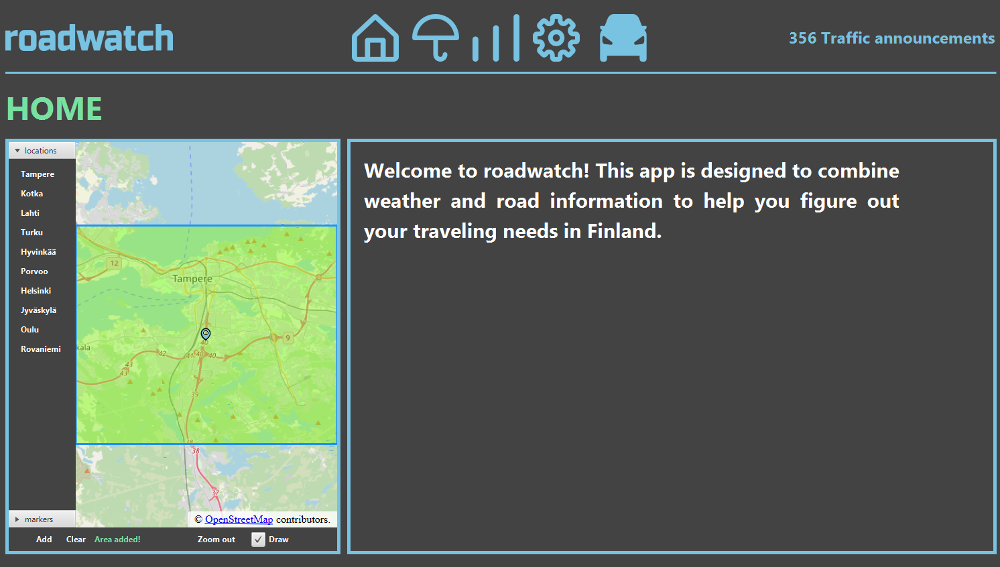
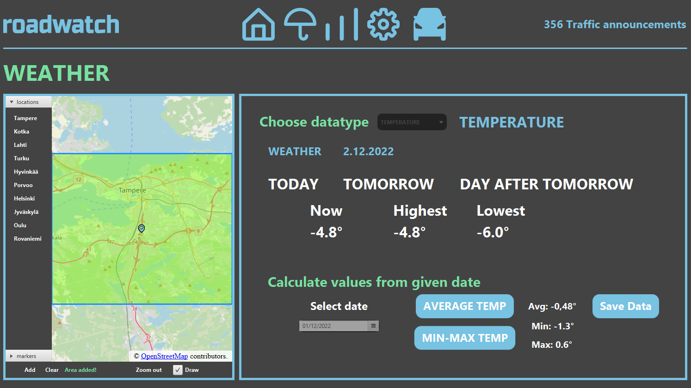
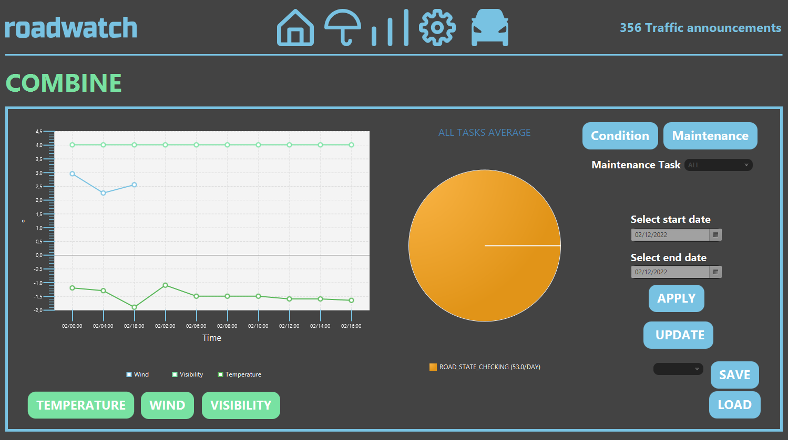
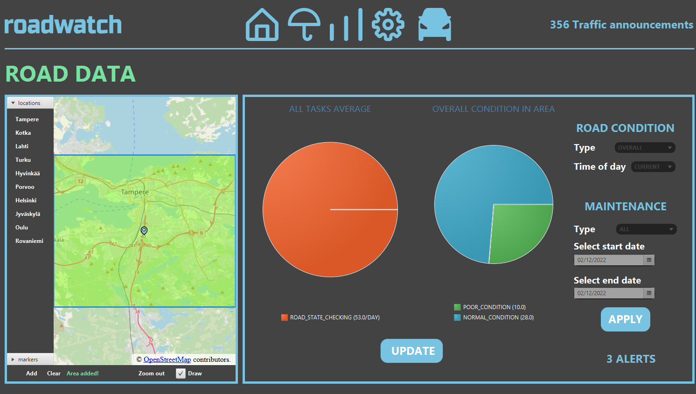

Figma link attached. The .fig project displays the current prototype idea for the application.

Build instructions:

1. Clone repository
2. Open "roadwatch"-project in IntellJ IDE
3. Make sure you don't see any errors, use JDK18
4. Install all dependencies from maven
5. Run RoadWatchApplication.java
6. The application should start

ROADWATCH

This application gathers weather information from the Finnish Meteorological Institute (FMI) API and road information from digitraffic API.
User is given the option to choose a location and what kind of data they want to see in a desired timeline.
User can also save data to their computer and download it into files. 
User can also combine different types of data and compare it to different data types.
The application contains a preferences page that allows to choose preferences and can be switched with a reset to the program to allow you
efficiently with app startup see desired data instantly. 

How to use:

The app is simple. First of all it is important to choose a desired location. You can choose a certain area from the map or choose a area
predefined to the map. After choosen location remember to press add on map. After that you will notice icons on the top of the page. 
Icon order: home, weatherData, combinePage, preferences, roadData. 

In weatherData if you want to see the temperatures of today, tomorrow and day after tomorrow
you simply click the labels. Average temp and min max of a certain day can be calculated by choosing date from calendar and simply pressing button. Changing datatype
allows you to see temperature, wind and visibility in a chart form. Simply choose the dates and click on all the data wanted to see. 

In combinePage charts work the same way as in weatherData charts. You can also choose to see condition or maintenance data and have the option to choose condition type and timeframe.
Simply choose wanted dates and data types and enjoy after pressing apply ofcourse. From this page you can save desired data to a file form and load data.

PreferencesPage simply choose your preferences and after restarting the application your saved preferences will be saved. Remember to save them!

RoadCondition page works by choosing desired roadcondition and maintenance types and timeline and simply pressing apply.

That is pretty much it! If you try to do something wrong the application will error message you. When using the application remember to use common sense and not try
to choose an enormous area from map or areas outside of Finland.
